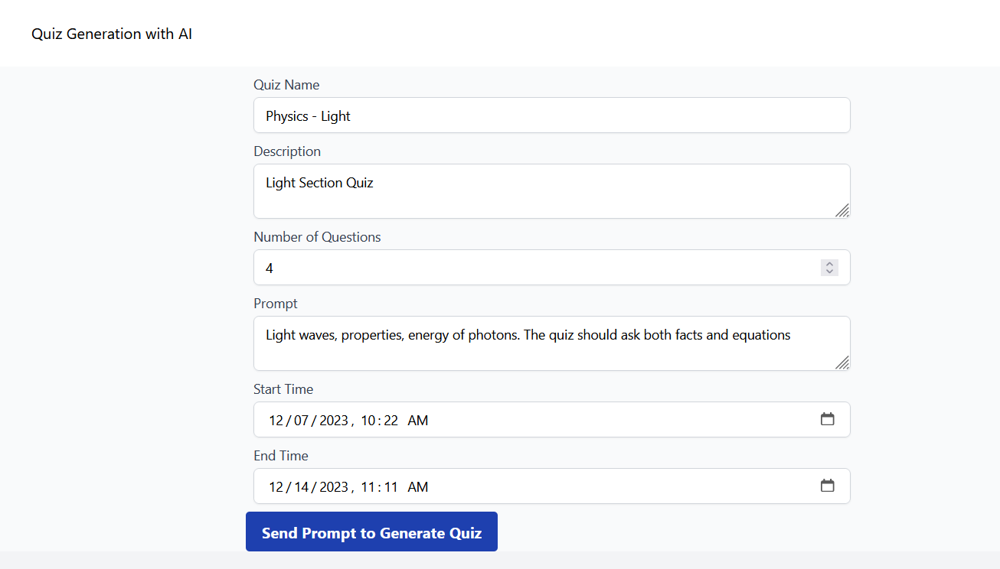
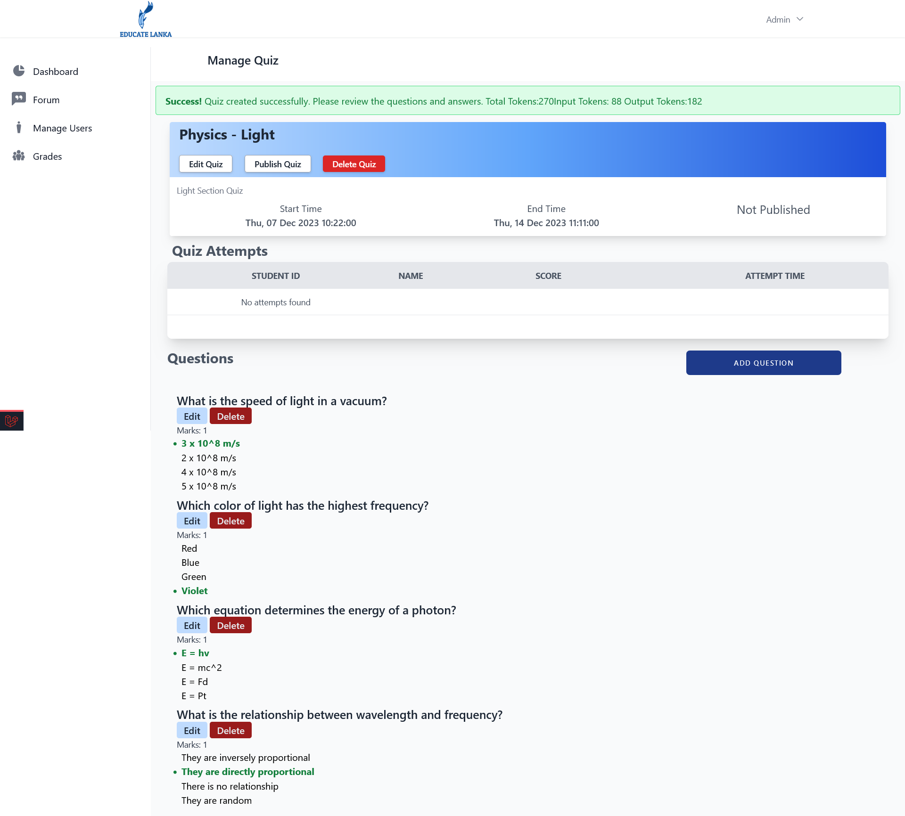
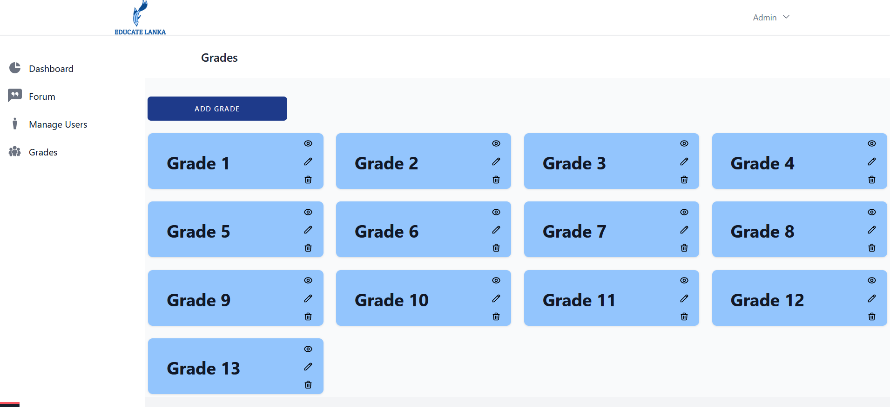
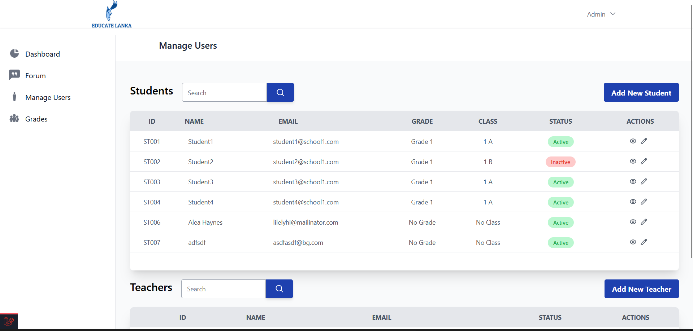
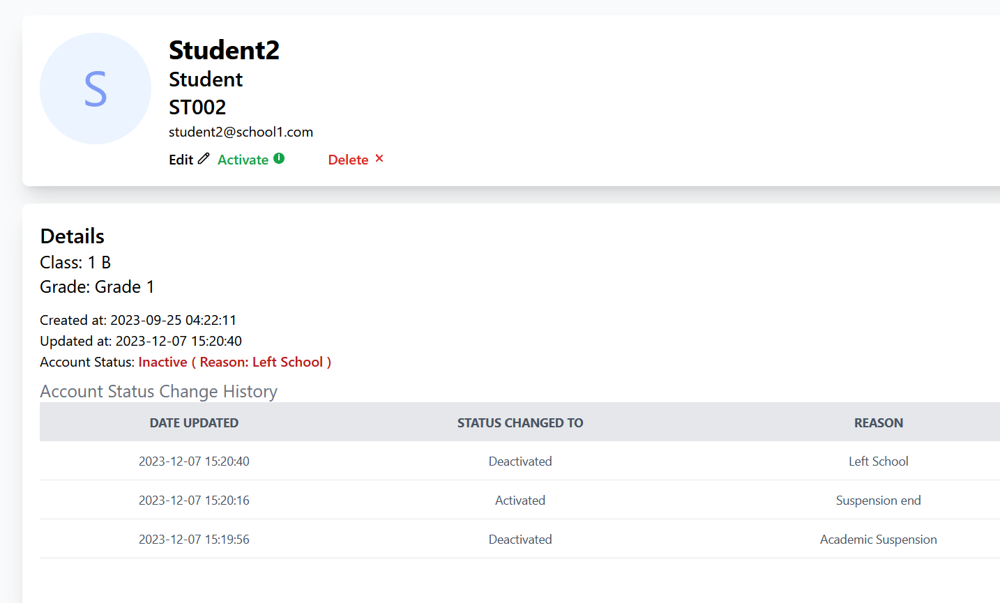
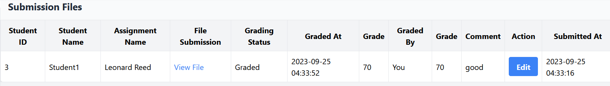

# EducateLanka - Group 3 - CC project
<p align="center"></p>

Educate Lanka is a laravel based Learning Management System to help the Sri Lankan school education system.

Technologies : Laravel , Livewire , Tailwind CSS , Alphine JS , OpenAI API
## Contents

- [EducateLanka - group3-CC-project](#educatelanka---group3-cc-project)
  - [Contents](#contents)
  - [Features](#features)
    - [AI Generated Quiz Feature](#ai-generated-quiz-feature)
    - [LMS Functionalities](#lms-functionalities)
       - User Management
       - Grade and Class Management
       - Subject Management
       - Course Resources management
       - Quiz and Assignment Management
    
    - [Forum](#forum) 
  - [Getting Started](#getting-started)
    - [Prerequisites](#prerequisites)
    - [Installation](#installation)

    
## Features
### AI Generated Quiz Feature
The project uses the Open API to generate questions and answers for a given prompt.
The package used for this is https://github.com/openai-php/laravel.

The model used was the GPT-3.5 Turbo model.





To use the API, obtain an API key by signing up at https://platform.openai.com/ and 
create a new API key from here: https://platform.openai.com/account/api-keys

Then add the API key to the .env file as follows:
```env
OPENAI_API_KEY=<your-api-key>
```
>[!NOTE]
>Since this is a paid API, refer the OpenAI pricing page for more information about pricing for the GPT-3.5 turbo model: https://openai.com/pricing/

### LMS Functionalities





### Forum
A forum for students to discuss was implemented by using the Package: https://github.com/Team-Tea-Time/laravel-forum

A forum category is created for each subject automatically when a new subject is created.

## Getting Started

### Prerequisites

Node JS, NPM, PHP, Composer, Laravel

### Installation

1.  Clone the github repository.

    ```bash
        git clone https://github.com/sachintha-lk/cc-project/
    ```

2.  Install the dependencies.

    Move in to the folder

    ```bash
    cd cc-project
    ```

    ```bash
    composer install
    ```

    ```bash
    npm install
    ```

    Build with vite

    ```npm
    npm run build
    ```

3.  Create the .env file by copying .env.example

    Generate an app encryption key

    ```bash
    php artisan key:generate
    ```

4.  Create a database and configure the .env file.
    For this either use a Sqlite database or a MySQL database.
    Follow instructions in configuring the env file: https://laravel.com/docs/10.x/database

5.  Run the migrations.
    ```bash
    php artisan migrate
    ```
6.  Run the seeder.

    ```bash
    php artisan db:seed
    ```

7.  Run the dev server.

    ```bash
    npm run dev
    ```

    ```bash
    php artisan serve
    ```
